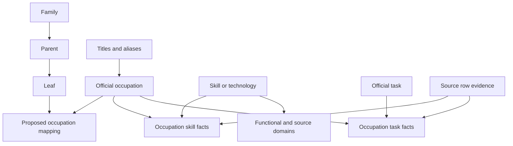

# English IT Knowledge Base

A populated relational reference database for interpreting candidate skills and job-offer needs. Built from the supplied technology taxonomy, reviewed title list, O*NET 31.0, ESCO 1.2.1 (English), OSCA 2024 v1.0 and ISCO-08 files.

**Start with `docs/BUILD_REPORT.md` for measured coverage and remaining gaps.** Open `it_knowledge.sqlite` in a SQLite client, or use the Python adapter below. Every original technology ID and reviewed title row is retained.

This delivery creates a **separate proposed taxonomy**, `IT_KB_1.0.0_PROPOSED`. The archive did not include the previous production taxonomy or Nesta extraction output. It does not overwrite the existing parent resolver, production IDs, or skills extractor. The database is structurally validated; it is not a trained or gold-evaluated classifier.

## What is included

| File or folder | Purpose |
|---|---|
| `it_knowledge.sqlite` | Populated SQLite database, relational constraints, views and full-text indexes |
| `schema.sql` | Complete relational schema and query views |
| `src/it_kb.py` | Read-only skill normalization, title lookup, occupation retrieval, task candidates and CV/job comparison |
| `examples/queries.sql` | Source-traceable SQL examples |
| `examples/candidate.json`, `examples/job.json` | Explicitly synthetic parsed-document examples |
| `exports/technology_coverage.csv` | One row for every supplied technology, including missing links |
| `exports/reviewed_titles_candidate_leaf_sets_v3.csv` | Canonical reviewed title mappings, including multi-leaf candidate sets and description-validation flags |
| `exports/reviewed_titles_with_paths.csv` | Legacy single-path export retained for rollback/compatibility; runtime resolution prefers the v3 candidate-set export |
| `exports/title_source_correspondences.csv` | Title-to-source lexical matches, including competing interpretations |
| `exports/canonical_taxonomy.csv` | Proposed family → parent → leaf hierarchy |
| `exports/review_queue.csv` | Scope conflicts, ambiguous aliases, missing links and integration gaps |
| `exports/skill_catalog.csv`, `exports/skill_domains.csv` | Source-preserving skill and domain catalogs |
| `exports/source_tasks.csv` | Actual O*NET and OSCA task statements |
| `config/technology_enrichment.json` | Primary-documentation product corrections and selected duplicate-product identities |
| `src/policy.py`, `config/taxonomy_policy.json` | Inspectable taxonomy and scope proposals; Python policy is executable authority |
| `data/normalized_snapshot.jsonl.gz` | Complete portable data snapshot, including evidence records |
| `src/rebuild_snapshot.py` | Rebuild the database using only the Python standard library |
| `src/build_from_sources.py` | Re-run source ingestion from the unpacked original archive |
| `docs/INTEGRATION.md` | How to connect the database to Nesta, TECH V2, H2 and recommendations |
| `docs/DATA_DICTIONARY.md` | Every table, column, key and query view |
| `docs/validation_report.json` | Executed validation results |

## Run immediately

Python 3.10+ with SQLite JSON and FTS5 support is sufficient to query the delivered database. There is no server, API key, model download or internet dependency at runtime.

```bash
python src/it_kb.py title "Data Engineer"
python src/it_kb.py title "Python Developer"
python src/it_kb.py skill "Python"
python src/it_kb.py tasks "Python" --limit 5
python src/it_kb.py rank --skills Python PostgreSQL Docker --title "Backend Developer"
python src/it_kb.py match examples/candidate.json examples/job.json
python src/test_invariants.py
```

The `rank` command is an **untuned retrieval baseline**, not a recommendation probability. Its observed-skill overlap can be high for several occupations sharing the same stack. Title, actual duties, the existing H2 result and validation data must resolve that ambiguity. `title` returns candidates/proposals and does not claim a calibrated confidence.

For technologies already resolved by your extraction pipeline, pass their stable IDs in Python:

```python
import sys
sys.path.insert(0, "src")
from it_kb import ITKnowledgeBase

kb = ITKnowledgeBase()
context = kb.skill_context({"skill_id": "TECH::python"})
tasks = kb.task_candidates({"skill_id": "TECH::python"}, limit=5)
title = kb.lookup_title("Data Engineer")
kb.close()
```

A bare ambiguous word such as `Go` or a technology whose original matching policy is `CONTEXT_REQUIRED` is not automatically accepted by label lookup. Its already-validated `TECH::...` ID remains usable. This adapter does not implement full-text skill extraction or replace the upstream context checks.

## The relationships and their meaning



There are three deliberately different evidence levels:

1. **Source facts:** ESCO occupation/skill relations, O*NET occupation/software links and ratings, OSCA task statements, source hierarchies and OSCA/ISCO correspondence rows. These retain source evidence IDs.
2. **Identity links and curation:** Unique preferred/alternate technology labels and a small set of documented duplicate-product identities. Generic ESCO hidden labels are not accepted as product equivalence. Original IDs survive every canonicalization.
3. **Proposals:** The canonical occupation hierarchy, mappings into that hierarchy, functional-domain tags and software/task candidates inferred through an occupation. These are explicitly identified as proposals or indirect paths.

**A software item and a task belonging to the same occupation do not establish a direct software→task relationship.** `task_candidates()` exposes that useful path without mislabeling it. Literal task mentions are stored separately with exact text offsets; even those are not silently promoted to reviewed usage assertions.

**A skill associated with an occupation does not become a requirement of a particular job or a skill possessed by a candidate.** The `document*` tables are empty integration tables. Only evidence from an actual CV or offer should populate them.

## IT scope and taxonomy precision

- `core`: eligible for default IT queries.
- `conditional`: specialized informatics, field telecommunications or adjacent roles that need explicit IT duties in the document. Available for contextual review, excluded from default core queries.
- `reference_only`: a non-core source occupation retained solely to explain a competing match in the user's title list. No skill profile or task profile is imported for it.
- Input titles additionally use `review` and `excluded`; their original supplied IT/review labels remain intact.

An official preferred occupation title takes precedence over a conflicting alternate-title match. All competing matches remain visible. Common `backend`/`back-end`/`back end`, `frontend`, `fullstack` and `devops` spelling variants are normalized for titles only. Technology punctuation is preserved: C, C++ and C# remain distinct.

Broad source occupations map to a parent when a leaf would overstate precision. An ESCO/O*NET/OSCA source level is not automatically a canonical family, parent or leaf. Shared ISCO ancestry and partial OSCA correspondence are context, not proof of equivalent occupations.

## Rebuild and extend

Rebuild the same normalized snapshot into a new database, without the archive:

```bash
python src/rebuild_snapshot.py --output it_working.sqlite
```

Re-ingest the original source files, if changing source selection or taxonomy policies:

```bash
pip install -r requirements-build.txt
python src/build_from_sources.py --source-dir "path/to/job taxonomy"
python src/test_invariants.py
python src/export_release.py
```

The source builder writes the packaged database location. Make changes in a copy of the package, bump the taxonomy version, and inspect the resulting diff before adopting it in the production pipeline. The delivered archive is not modified.

To connect Nesta IDs, fill `exports/nesta_crosswalk_template.csv` with actual, reviewed IDs and import it into a working copy:

```bash
python src/import_reviewed_crosswalk.py --db it_working.sqlite --csv nesta_reviewed.csv
```

An external ID is namespaced. A Nesta numeric ID is never assumed to be an ESCO or O*NET ID. Missing external mappings are reported as unresolved rather than treated as missing candidate competence.

## Validation boundary

The package checks row preservation, foreign keys, canonical path consistency, acyclic skill identities, scope filtering, category precedence, exact evidence spans, ambiguous aliases, missing external IDs, and observed-only CV/job matching. A rebuilt snapshot is also compared table-by-table to the original delivery.

These checks establish data and software integrity. They do **not** measure family/parent/leaf F1, ranking quality or candidate suitability. No annotated English offer/CV gold dataset was supplied. See `docs/INTEGRATION.md` for the evaluation protocol and remaining work.

## Sources and attribution

Original source files are fingerprinted in `exports/source_manifest.csv`; each imported fact points to its source file and record locator. The supplied release versions are frozen, even if websites publish newer material later.

- O*NET 31.0 Database, U.S. Department of Labor / Employment and Training Administration: https://www.onetcenter.org/database.html. Adapted under CC BY 4.0: https://creativecommons.org/licenses/by/4.0/. Filtering, harmonization and derived mappings are additions in this package; USDOL/ETA has not endorsed them. O*NET® is a USDOL/ETA trademark. License: https://www.onetcenter.org/license_db.html.
- European Commission ESCO 1.2.1, English: https://esco.ec.europa.eu/en/use-esco.
- Australian Bureau of Statistics OSCA 2024 v1.0: https://www.abs.gov.au/statistics/classifications/osca-occupation-standard-classification-australia/2024-version-1-0.
- International Labour Organization ISCO-08: https://ilostat.ilo.org/methods/concepts-and-definitions/classification-occupation/.
- Technology corrections cite the individual official product documentation in `config/technology_enrichment.json`.
- The user's TECH V2 and reviewed-title snapshots retain their original provenance fields. Original CNCF, Devicon, Linguist and web-technology source catalogs were not separately supplied; their provenance strings are not treated as independently verified source downloads.
